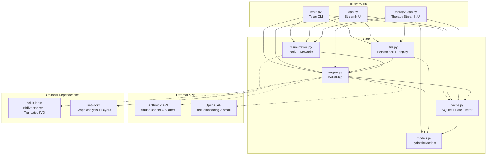
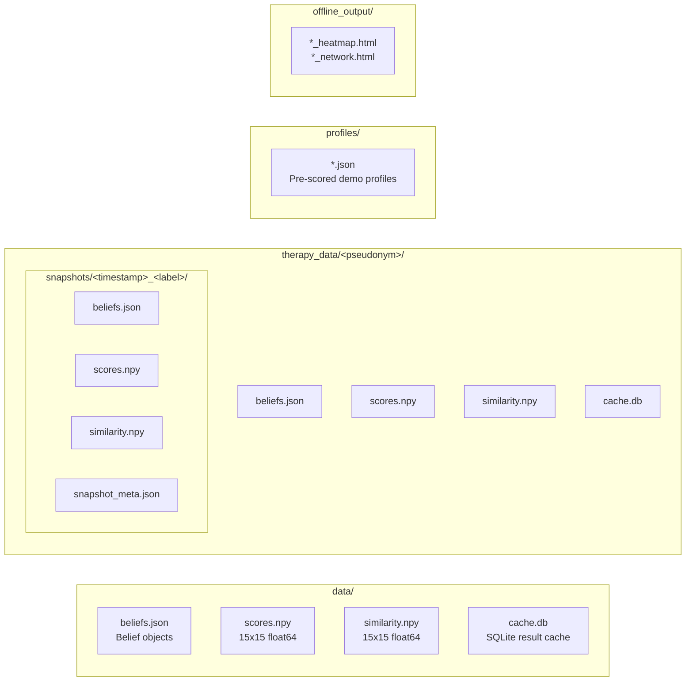

# Architecture

## Module Dependency Graph

```mermaid
graph TD
    subgraph Entry Points
        MAIN["main.py\nTyper CLI"]
        APP["app.py\nStreamlit UI"]
        THERAPY["therapy_app.py\nTherapy Streamlit UI"]
    end

    subgraph Core
        ENGINE["engine.py\nBeliefMap"]
        UTILS["utils.py\nPersistence + Display"]
        VIZ["visualization.py\nPlotly + NetworkX"]
        CACHE["cache.py\nSQLite + Rate Limiter"]
        MODELS["models.py\nPydantic Models"]
    end

    subgraph External APIs
        ANTHROPIC["Anthropic API\nclaude-sonnet-4-5-latest"]
        OPENAI["OpenAI API\ntext-embedding-3-small"]
    end

    subgraph Optional Dependencies
        SKLEARN["scikit-learn\nTfidfVectorizer + TruncatedSVD"]
        NETWORKX["networkx\nGraph analysis + Layout"]
    end

    %% main.py imports
    MAIN --> ENGINE
    MAIN --> UTILS
    MAIN --> VIZ
    MAIN --> CACHE

    %% app.py imports
    APP --> ENGINE
    APP --> UTILS
    APP --> VIZ
    APP --> CACHE

    %% therapy_app.py imports
    THERAPY --> ENGINE
    THERAPY --> UTILS
    THERAPY --> VIZ
    THERAPY --> CACHE
    THERAPY --> MODELS

    %% engine.py imports
    ENGINE --> CACHE
    ENGINE --> MODELS

    %% utils.py imports
    UTILS --> ENGINE
    UTILS --> MODELS

    %% visualization.py imports
    VIZ --> ENGINE

    %% cache.py imports
    CACHE --> MODELS

    %% Optional / runtime imports (dashed)
    ENGINE -.-> ANTHROPIC
    ENGINE -.-> OPENAI
    ENGINE -.-> SKLEARN
    ENGINE -.-> NETWORKX
    VIZ -.-> NETWORKX
```

## Storage Layout

```mermaid
graph LR
    subgraph "data/"
        BELIEFS["beliefs.json\nBelief objects"]
        SCORES["scores.npy\n15x15 float64"]
        SIM["similarity.npy\n15x15 float64"]
        CACHEDB["cache.db\nSQLite result cache"]
    end

    subgraph "therapy_data/&lt;pseudonym&gt;/"
        T_BELIEFS["beliefs.json"]
        T_SCORES["scores.npy"]
        T_SIM["similarity.npy"]
        T_CACHE["cache.db"]
        subgraph "snapshots/&lt;timestamp&gt;_&lt;label&gt;/"
            SNAP_BELIEFS["beliefs.json"]
            SNAP_SCORES["scores.npy"]
            SNAP_SIM["similarity.npy"]
            SNAP_META["snapshot_meta.json"]
        end
    end

    subgraph "profiles/"
        PROFILES["*.json\nPre-scored demo profiles"]
    end

    subgraph "offline_output/"
        OFFLINE["*_heatmap.html\n*_network.html"]
    end
```
