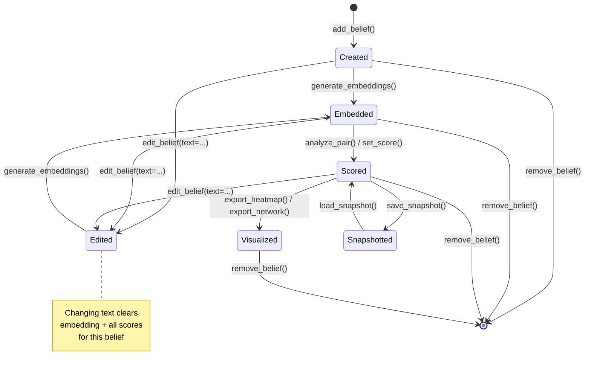
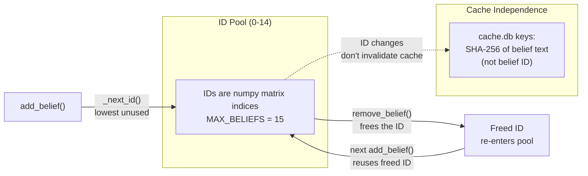

# Belief Lifecycle

## State Transitions

## ID Lifecycle

### ID reuse example

| Step | Action | IDs in use | Next available |
|---|---|---|---|
| 1 | `add_belief("A")` | {0} | 1 |
| 2 | `add_belief("B")` | {0, 1} | 2 |
| 3 | `add_belief("C")` | {0, 1, 2} | 3 |
| 4 | `remove_belief(1)` | {0, 2} | **1** |
| 5 | `add_belief("D")` | {0, **1**, 2} | 3 |

Belief "D" gets ID 1 (the lowest free slot). Cache entries for the old belief "B" remain in `cache.db` keyed by the SHA-256 hash of `"B"` -- they are harmless orphans and do not interfere.
