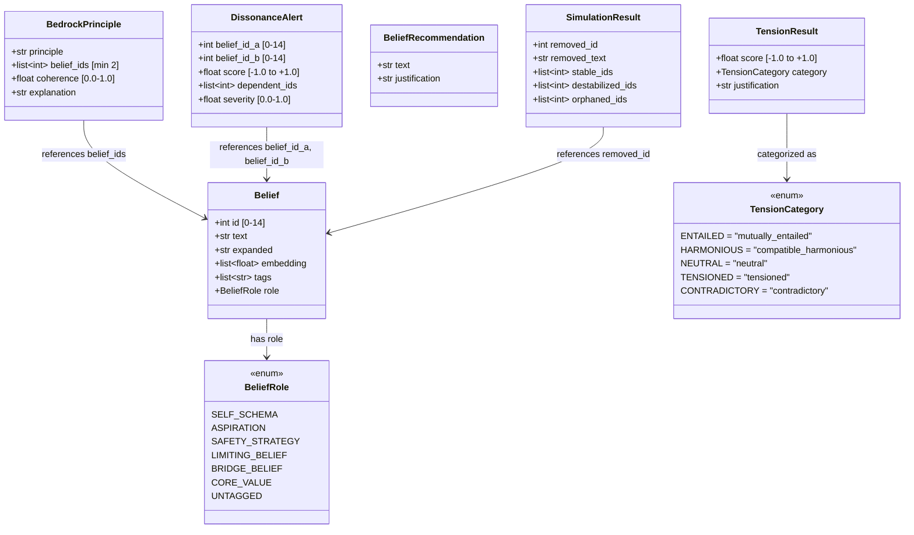

# Data Models

## Class Diagram

## Score Scale

| TensionCategory | Value | Score Range | Description |
|---|---|---|---|
| `mutually_entailed` | `"mutually_entailed"` | +0.8 to +1.0 | One belief necessitates the other |
| `compatible_harmonious` | `"compatible_harmonious"` | +0.1 to +1.0 | Support the same worldview |
| `neutral` | `"neutral"` | -0.3 to +0.3 | Unrelated beliefs |
| `tensioned` | `"tensioned"` | -1.0 to -0.1 | Difficult to hold both simultaneously |
| `contradictory` | `"contradictory"` | -1.0 to -0.4 | Logically impossible to hold both |

> **Note:** Ranges overlap intentionally. The LLM chooses both score and category; `engine.py` logs a warning if they are inconsistent but does not reject the result.
