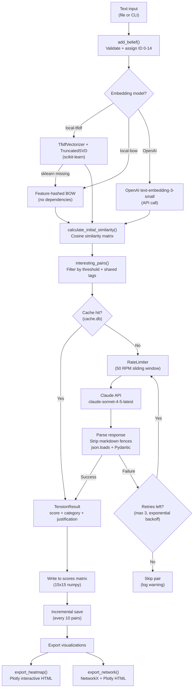
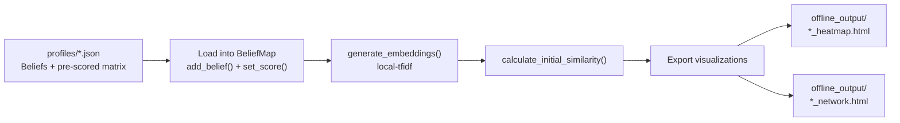
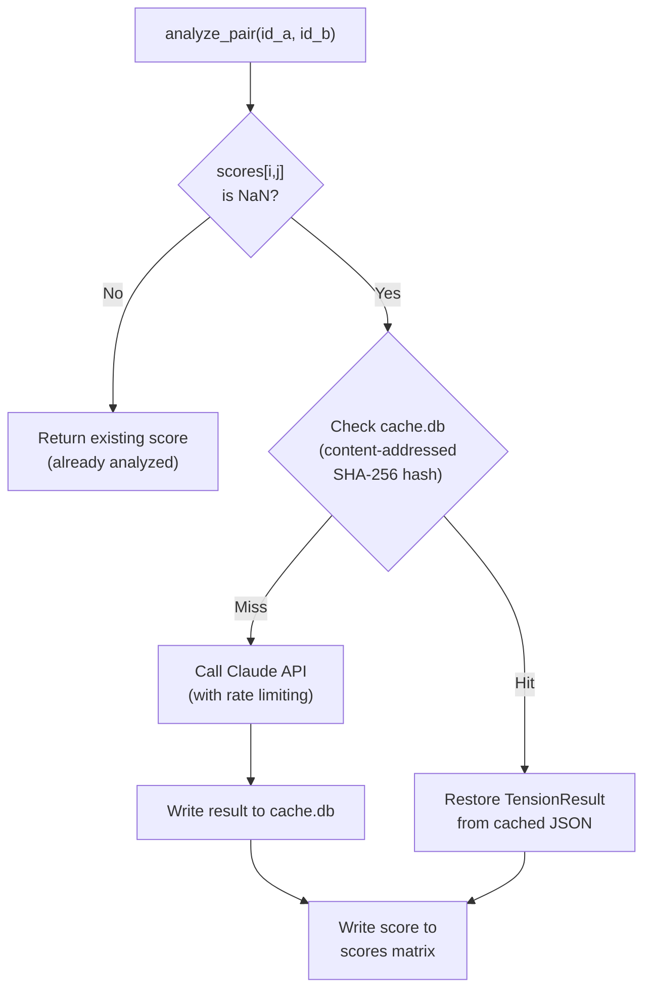

# Pipeline

## Full Analysis Pipeline

```mermaid
flowchart TD
    INPUT["Text input\n(file or CLI)"] --> ADD["add_belief()\nValidate + assign ID 0-14"]
    ADD --> EMBED_CHOICE{Embedding model?}

    EMBED_CHOICE -->|local-tfidf| TFIDF["TfidfVectorizer + TruncatedSVD\n(scikit-learn)"]
    EMBED_CHOICE -->|local-bow| BOW["Feature-hashed BOW\n(no dependencies)"]
    EMBED_CHOICE -->|OpenAI| OAI["OpenAI text-embedding-3-small\n(API call)"]
    TFIDF -->|sklearn missing| BOW

    TFIDF --> SIM
    BOW --> SIM
    OAI --> SIM

    SIM["calculate_initial_similarity()\nCosine similarity matrix"] --> INTERESTING["interesting_pairs()\nFilter by threshold + shared tags"]

    INTERESTING --> CACHE_CHECK{"Cache hit?\n(cache.db)"}
    CACHE_CHECK -->|Yes| RESULT
    CACHE_CHECK -->|No| RATE["RateLimiter\n(50 RPM sliding window)"]

    RATE --> CLAUDE["Claude API\nclaude-sonnet-4-5-latest"]
    CLAUDE --> PARSE["Parse response\nStrip markdown fences\njson.loads + Pydantic"]
    PARSE -->|Success| RESULT["TensionResult\nscore + category + justification"]
    PARSE -->|Failure| RETRY{"Retries left?\n(max 3, exponential backoff)"}
    RETRY -->|Yes| RATE
    RETRY -->|No| SKIP["Skip pair\n(log warning)"]

    RESULT --> MATRIX["Write to scores matrix\n(15x15 numpy)"]
    MATRIX --> SAVE["Incremental save\n(every 10 pairs)"]
    SAVE --> VIZ["Export visualizations"]

    VIZ --> HEATMAP["export_heatmap()\nPlotly interactive HTML"]
    VIZ --> NETWORK["export_network()\nNetworkX + Plotly HTML"]
```

## Offline Demo Path

```mermaid
flowchart LR
    PROFILE["profiles/*.json\nBeliefs + pre-scored matrix"] --> LOAD["Load into BeliefMap\nadd_belief() + set_score()"]
    LOAD --> LOCAL_EMBED["generate_embeddings()\nlocal-tfidf"]
    LOCAL_EMBED --> LOCAL_SIM["calculate_initial_similarity()"]
    LOCAL_SIM --> EXPORT["Export visualizations"]
    EXPORT --> HM["offline_output/\n*_heatmap.html"]
    EXPORT --> NET["offline_output/\n*_network.html"]
```

## Cache Resolution

```mermaid
flowchart TD
    ANALYZE["analyze_pair(id_a, id_b)"] --> NAN{"scores[i,j]\nis NaN?"}
    NAN -->|No| DONE["Return existing score\n(already analyzed)"]
    NAN -->|Yes| CACHE{"Check cache.db\n(content-addressed\nSHA-256 hash)"}
    CACHE -->|Hit| RESTORE["Restore TensionResult\nfrom cached JSON"]
    CACHE -->|Miss| API["Call Claude API\n(with rate limiting)"]
    API --> WRITE_CACHE["Write result to cache.db"]
    WRITE_CACHE --> WRITE_MATRIX["Write score to\nscores matrix"]
    RESTORE --> WRITE_MATRIX
```
